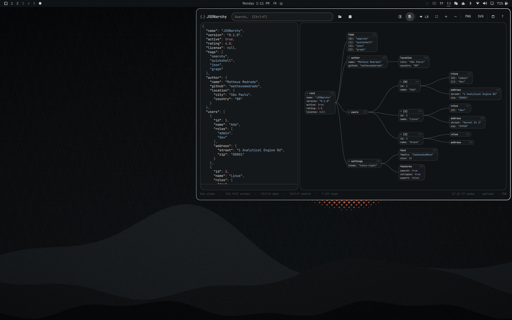

# JSONarchy

JSON Crack for the [Omarchy](https://omarchy.org) shell. Paste, drop, or open a
JSON document and explore it as a graph from your bar.



- Objects and arrays become nodes, primitives are rows, edges link parents to children
- Compact popup under the bar icon, or full screen with `F11`
- Search keys and values, collapse subtrees, inspect any node's path and value
- Editor with syntax highlighting and live re-parse
- Export the graph as PNG or SVG
- Native Quickshell/QML, themed by your Omarchy theme, no web view, no network

## Install

```sh
omarchy plugin add https://github.com/matheusmedrado/jsonarchy --enable
```

That adds a `{..}` icon to the bar. Left click opens JSONarchy, right click
loads the clipboard first. Move it like any other widget:

```sh
omarchy plugin enable io.github.matheusmedrado.jsonarchy right --before omarchy.clipboard
```

### Uninstall

```sh
omarchy plugin remove io.github.matheusmedrado.jsonarchy
rm -f ~/.local/state/omarchy/jsonarchy.json   # optional: saved preferences
```

Removing the plugin takes the icon off the bar and deletes the plugin
folder. Nothing else on the system is touched.

### Dependencies

Everything ships with Omarchy: Quickshell, `wl-clipboard` (clipboard reads
and PNG copy), `omarchy file select` (the desktop file chooser), and
`omarchy notification send` plus `xdg-open` (export notifications). No
network access, no background processes, no elevated privileges.

## Usage

Click the icon, then paste JSON into the editor, press `Ctrl+O` to open a
file, `Ctrl+Shift+V` to load the clipboard, or drop a file onto the editor.
Press `?` inside JSONarchy for the full key list.

| Key | Action |
|-----|--------|
| `Esc` | Close help, clear search, deselect, close |
| `F11` | Compact popup / full screen |
| `Ctrl+O` | Open a file |
| `Ctrl+Shift+V` | Load the clipboard |
| `Ctrl+Shift+F` | Format the document |
| `Ctrl+F` | Search. `Enter` / `Shift+Enter` cycle matches |
| `Ctrl+E` | Show or hide the editor |
| `Ctrl+L` | Left-to-right / top-to-bottom layout |
| `Ctrl+0` | Fit graph to view |
| `Ctrl+Shift+E` / `Ctrl+Shift+C` | Expand all / collapse all |
| `Ctrl+S` / `Ctrl+Shift+S` | Export PNG / SVG |
| `?` | All keys and commands |

Mouse and trackpad: two-finger scroll pans, pinch zooms, wheel zooms, drag
pans. Click a node to inspect it, double-click to collapse or expand it.

### Scripting

```sh
omarchy-shell jsonarchy toggle
omarchy-shell jsonarchy exportPng           # or exportSvg
omarchy-shell shell summon io.github.matheusmedrado.jsonarchy '{"file": "/path/data.json"}'
omarchy-shell shell summon io.github.matheusmedrado.jsonarchy '{"clipboard": true}'
omarchy-shell shell summon io.github.matheusmedrado.jsonarchy '{"text": "{\"a\": 1}", "size": "full"}'
```

Payload keys: `file`, `text`, `clipboard`, `direction` (`LR` or `TB`),
`size` (`compact` or `full`), `show` (open without toggling).

Suggested Hyprland binding for `~/.config/hypr/bindings.conf`:

```
bindd = SUPER SHIFT, J, JSONarchy, exec, omarchy-shell shell toggle io.github.matheusmedrado.jsonarchy '{}'
```

## Limits

JSONarchy runs inside the long-lived shell process, so every way in is
bounded before anything is parsed:

| Input | Limit | Behaviour over the limit |
|-------|-------|--------------------------|
| File (`Ctrl+O`, drop, `file` payload) | 1 MiB, regular files only | Rejected by `bin/read-bounded.sh` before it is opened: devices such as `/dev/zero`, FIFOs, directories, and dangling symlinks are refused; larger files are refused by size. A 10 s timeout backs that up. |
| Clipboard | 1 MiB | `wl-paste` output is cut one byte past the limit and rejected. |
| `text` payload and editor contents | 1 MiB | Not parsed; the status line says why. |
| Editor display | 512 KiB | Larger documents show the graph only. |
| Graph | 20 000 nodes, depth 200 | Containers beyond the budget become a `{…}` / `[…]` row and the status line reports how many were cut. Over 2 500 visible nodes, deeper levels start collapsed. |

The caps are single constants in `Service.qml` (`maxInputBytes`,
`maxEditorChars`) and `Model.js` (`MAX_TOTAL_NODES`, `MAX_DEPTH`).

## Notes

- Window size, layout direction, and editor visibility are remembered in
  `~/.local/state/omarchy/jsonarchy.json`.
- Exports go where Omarchy screenshots go (`~/Pictures` by default). PNG
  exports are also copied to the clipboard.
- Documents over 2500 nodes are auto-collapsed below the deepest depth that
  fits; expand by hand or search to reveal.
- Reads only the files you open. Writes only the state file above, exports
  in your Pictures directory, and the clipboard when you ask for it. Enabling
  adds the bar entry to `shell.json` through the standard plugin mechanism;
  no other user configuration is modified.

## Development

Clone this repository to a folder of your choice (say `~/JSONarchy`), then:

```sh
ln -s ~/JSONarchy ~/.config/omarchy/plugins/io.github.matheusmedrado.jsonarchy
omarchy plugin enable io.github.matheusmedrado.jsonarchy
./dev-reload.sh '{"file": "'"$PWD"'/tests/sample.json"}'   # tests, validate, restart shell, summon
```

The shell does not reload QML from a symlinked plugin on its own, hence the
restart in `dev-reload.sh`.

| Path | Purpose |
|------|---------|
| `Service.qml` | Document state, parsing, layout, search, loading, preferences |
| `Panel.qml` | Bar icon and the compact popup |
| `Overlay.qml` | Full-screen surface |
| `components/Workspace.qml` | Shared UI: header, editor, graph, inspector, footer, help |
| `components/GraphView.qml` | Pan/zoom viewport, edge shapes, layout tween |
| `bin/read-bounded.sh` | Bounded file reader: regular files only, size cap, run as a child process |
| `Model.js` | Graph building with node and depth budgets, tree layout, search (pure JS, tested) |
| `components/Highlight.js` | JSON tokenizer and accent-derived palette |
| `components/Export.js` | SVG writer |
| `tests/` | `node tests/model.test.js`, `highlight.test.js`, `export.test.js`, `read-bounded.test.js` |

## License

[MIT](LICENSE)
